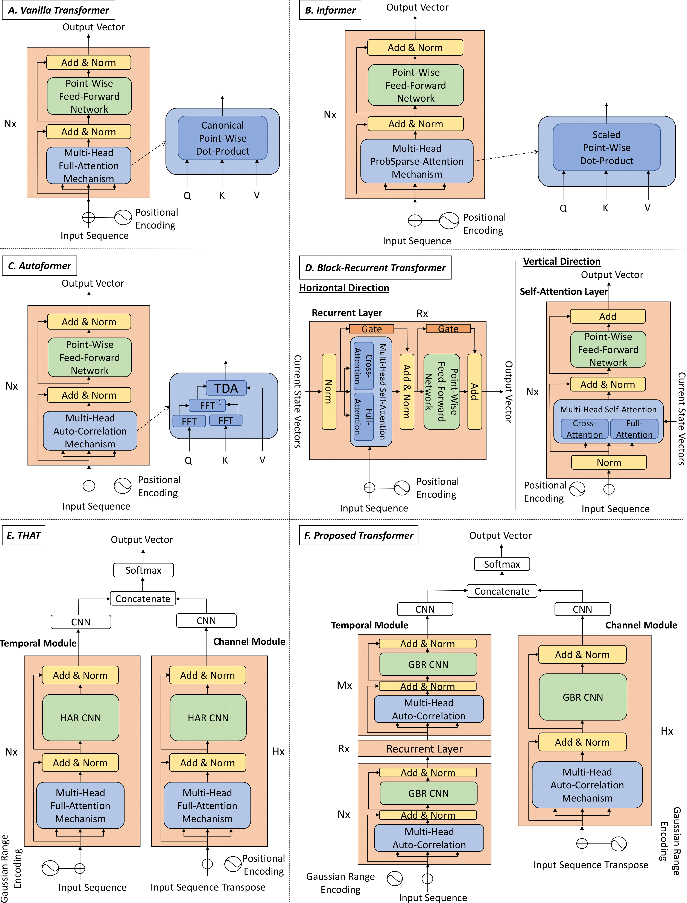

# Exploring Transformers for Behavioural Biometrics: A Case Study in Gait Recognition



# Citation

If you use our code please cite:

```
@article{delgado2022exploring,
  title={{Exploring Transformers for Behavioural Biometrics: A Case Study in Gait Recognition}},
  author={Delgado-Santos, Paula and Tolosana, Ruben and Guest, Richard and Deravi, Farzin and Vera-Rodriguez, Ruben},
  journal={Under Review in Pattern Recognition},
  year={2022}
}

```

# Overview

This article explores and proposes novel behavioural biometric systems based on Transformers.

Transformers are more recently proposed DL architectures that have already garnered impmense interest due to their effectiveness across a range of application domains such as language assessment, vision, and reinforcement learning. Their main advantages compared with traditional CNN and RNN architectures are: *i)* Transformers are feed-forward models that process all the sequences in parallel, therefore increasing efficiency; *ii)* They apply Self-Attention/Auto-Correlation mechanisms that allows them to operate in long sequences; *iii)* They can be trained efficiently in a single batch since all the sequence is included in every batch; and *iv)* They can attend to the whole sequence, instead of summarising all the previous temporal information.

To the best of our knowledge, this is the first study that explores the potential of Transformers for behavioural biometrics, in particular, gait biometric recognition on mobile devices. Several state-of-the-art Transformer architectures are considered in the evaluation framework (Vanilla, Informer, Autoformer, Block-Recurrent Transformer, and THAT), comparing them with traditional CNN and RNN architectures. In addition, new configurations of the Transformers are proposed to further improve the performance.

# Experimental Protocol

In this repository we include the experimental protocol followed in our experiments for the two popular public databases whuGAIT [\[2\]](https://github.com/qinnzou/Gait-Recognition-Using-Smartphones) and OU-ISIR [\[3\]](https://www.sciencedirect.com/science/article/pii/S003132031300280X). It was presented by Zou *et al.* in [\[2\]](https://github.com/qinnzou/Gait-Recognition-Using-Smartphones), being a predefined division of the database into development and evaluation datasets in order to facilitate the comparison among approaches.


# Benchmark Evaluation on Gait Recognition

The proposed Transformer has outperformed previous Transformer architectures and traditional DL architectures (i.e., CNNs, RNNs, and CNNs + RNNs) when evaluated using both databases whuGAIT [\[2\]](https://github.com/qinnzou/Gait-Recognition-Using-Smartphones) and OU-ISIR [\[3\]](https://www.sciencedirect.com/science/article/pii/S003132031300280X). In particular, for the challenging OU-ISIR database, the proposed Transformer achieves 93.33% accuracy, resulting in accuracy absolute improvements compared with other techniques of 7.59% (THAT), 28.81% (Block-Recurrent Transformer), 30.23% (Autoformer), 33.93% (Informer), and 38.82% (Vanilla Transformer). The proposed Transformer has also been compared with state-of-the-art gait biometric recognition systems, outperforming the results presented in the literature. In addition, it is important to highlight the enhanced time complexity and memory usage of the proposed Transformer compared with traditional DL models.


# Dependences 

`conda=22.9.0`

`CUDA`

`numpy=1.24.1`

`python=3.9.7`

`torch=1.11.0`


# Code

We will provide the evaluation scripts together with their pre-trained models shortly.
<!--We provide the evaluation scripts together with their pre-trained models in this repo. -->

| whuGAIT | OU-ISIR |
| --- | --- |
| [Vanilla Transformer](./Scripts/VanillaTransformer_whuGAIT_Evaluation.py) | [Vanilla Transformer](./Scripts/VanillaTransformer_OUISIR_Evaluation.py) |
| [Informer](./Scripts/Informer_whuGAIT_Evaluation.py) | [Informer](./Scripts/Informer_OUISIR_Evaluation.py) |
| [Autoformer](./Scripts/Autoformer_whuGAIT_Evaluation.py) | [Autoformer](./Scripts/Autoformer_OUISIR_Evaluation.py) |
| [Block-Recurrent Transformer](./Scripts/BlockRecurrentTransformer_whuGAIT_Evaluation.py) | [Block-Recurrent Transformer](./Scripts/BlockRecurrentTransformer_OUISIR_Evaluation.py) |
| [THAT](./Scripts/THAT_whuGAIT_Evaluation.py) | [THAT](./Scripts/THAT_OUISIR_Evaluation.py) |
| [Proposed Transformer](./Scripts/ProposedTransformer_whuGAIT_Evaluation.py) | [Proposed Transformer](./Scripts/ProposedTransformer_OUISIR_Evaluation.py) |


# Contact

If you have any questions, please contact us at [paula.delgado-de-santos@kent.ac.uk](mailto:paula.delgado-de-santos@kent.ac.uk) or [ruben.tolosana@uam.es](mailto:ruben.tolosana@uam.es).
